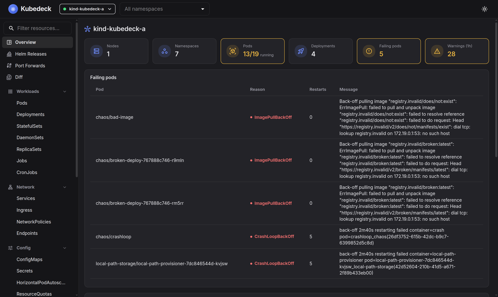
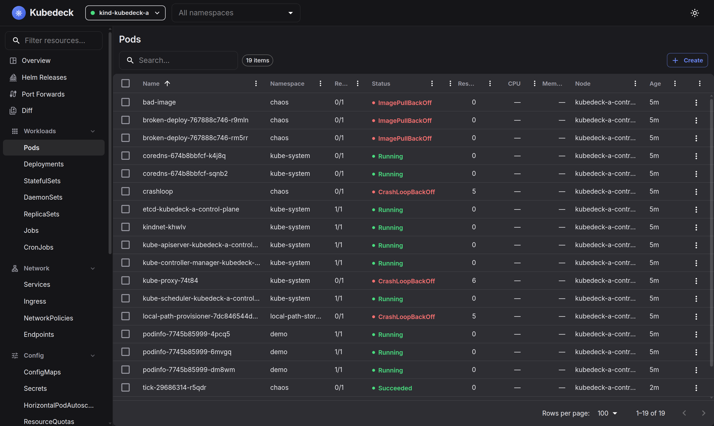

# ⎈ Kubedeck

**A free, open-source Kubernetes GUI** 

Connect to all your clusters at once, browse and edit every resource (CRDs included), stream aggregated logs, open shells into containers, forward ports, watch metrics, and inspect Helm releases — all from one polished web UI that runs entirely on your machine.





## Features

- **Multi-cluster, unified view** — connect to any number of kubeconfig contexts simultaneously; lists merge resources from all selected clusters with a cluster column.
- **Every resource kind** — builtin workloads, networking, config, storage, RBAC… plus all CRDs discovered dynamically, including their `additionalPrinterColumns` rendered as real list columns.
- **Live updates** — informer-style watches over WebSocket keep every list in sync without refreshing (incl. resilient 410/reconnect handling).
- **Human-friendly details + YAML editor** — Monaco-powered YAML view/edit/create with conflict detection, plus per-kind overview tabs, events and metrics.
- **Quick actions** — delete, scale, rollout-restart, pause/resume rollouts, trigger CronJobs, re-run Jobs, cordon/uncordon and drain nodes (with live progress).
- **Rollout history & rollback** — browse Deployment/StatefulSet revisions (images, change cause) and roll back to any of them, like `kubectl rollout undo`.
- **Events timeline** — cluster-wide live events page with deduplication, warnings-only filter and jump-to-object.
- **Aggregated log viewer** — stream logs from many pods at once, color-coded per pod, regex filter, follow, download, previous-container logs.
- **Container shell & debugging** — full xterm.js terminal over the Kubernetes exec API (bash with sh fallback, resize support), ephemeral debug containers for distroless pods (`kubectl debug`), and a privileged **node shell** that nsenters into any node.
- **File copy** — download/upload files (and directories as tar) to and from containers, like `kubectl cp`.
- **Port forwarding** — one click from any Pod or Service (service ports resolve to targetPorts like kubectl), with a management panel.
- **Metrics & health overview** — CPU/memory from metrics-server with history charts, and a dashboard flagging failing pods, unavailable workloads, restarts and warning events.
- **Helm releases** — list, values (user + computed), manifests, history, rollback and uninstall — no helm binary required.
- **Command palette** — Ctrl+K searches resources, kinds and pages, runs actions on any resource (logs, shell, restart…) and app commands (`>` prefix), fully keyboard-driven.
- **Production guard** — mark clusters as protected: destructive actions then require typing the resource name to confirm.
- **Resource diff** — side-by-side Monaco diff of any two resources across clusters/namespaces, with noise-field normalization.
- **Dark & light mode**, of course.

## Security model

Kubedeck is a *local* tool:

- The server binds to `127.0.0.1` only and talks directly to your cluster API servers using your existing kubeconfig — no data leaves your machine.
- Every request requires a random per-run bearer token (the browser receives it via the launch URL), protecting against DNS-rebinding/CSRF on localhost.
- Secret values are redacted by default everywhere (lists, details, watch streams); revealing them is an explicit per-resource action.

## Getting started

### Desktop app

Download the installer for your platform from the [releases page](https://github.com/FloSch62/kubedeck/releases): Windows (`.exe`), macOS (`.dmg`, Intel + Apple Silicon), Linux (`.AppImage`/`.deb`).

> **macOS note:** builds are not code-signed yet. On first launch, right-click the app and choose *Open* (or run `xattr -dr com.apple.quarantine /Applications/Kubedeck.app`).

### From source

Requires **Node.js ≥ 22** and **pnpm**.

```bash
pnpm install
pnpm build
pnpm start          # serves the UI and opens your browser
```

The server reads `~/.kube/config` (or `$KUBECONFIG`, or `--kubeconfig <path>`) and picks a port with `--port <n>` (default 3001).

### Development

```bash
pnpm dev            # tsx-watch server on :3001 + Vite client on :5173
```

Open `http://localhost:5173` — the Vite dev server proxies `/api` and `/ws` to the backend.

To run the desktop shell locally: `pnpm electron` (builds everything, then launches Electron). `pnpm dist` packages installers for the current platform into `electron/release/`.

### Releasing

Push a `v*` tag (or create a GitHub release with a new `v*` tag — that pushes the tag too). The release workflow then builds installers on Windows/macOS/Linux runners and attaches them to the GitHub release for that tag, creating it if it doesn't exist yet:

```bash
git tag v0.1.0
git push origin v0.1.0
```

### Test clusters

`hack/dev-clusters.sh` spins up two [kind](https://kind.sigs.k8s.io/) clusters with metrics-server, a sample Helm release, and intentionally broken workloads to exercise the overview dashboard.

## Architecture

```
┌─────────────────────────────────────┐
│  Browser — React 19 + MUI 7 SPA     │
│  TanStack Query · Monaco · xterm.js │
└──────────────┬──────────────────────┘
               │ REST + WebSocket (token-authed, same-origin)
┌──────────────┴──────────────────────┐
│  Node.js — Fastify 5                │
│  @kubernetes/client-node 1.x        │
│  watch multiplexing · log fan-in    │
│  exec bridge · port-forward manager │
│  helm secret decoding · metrics     │
└──────────────┬──────────────────────┘
               │ Kubernetes API (your kubeconfig credentials)
        ┌──────┴──────┐
        │  Clusters   │
        └─────────────┘
```

- `shared/` — TypeScript types + the WebSocket protocol (zod-validated) both sides compile against.
- `server/` — cluster manager (one isolated `KubeConfig` per context), generic resource routes driven by API discovery, informer-style watchers, helm release codec (base64 → gzip → JSON, read **and** write for rollback), exec bridge shared by container/node shells and file copy, metrics poller with ring buffers.
- `client/` — app shell (cluster switcher, nav drawer, namespace filter, command palette, bottom dock for terminals/logs), generic resource list page powered by per-kind column presets + CRD printer columns, detail drawer, overview/events/helm/diff/forwards pages.
- `electron/` — desktop shell: runs the same server in-process on a random localhost port and opens it in a BrowserWindow; packaged with electron-builder.

## Known limitations

- Helm uninstall and rollback apply/delete manifest resources and write release records but do **not** run Helm hooks.
- Port forwards live as long as the server process.
- WebSocket port-forward requires a reasonably recent API server (kubectl's SPDY fallback is not implemented).
- Node shells start a privileged pod in a dedicated `kubedeck-debug` namespace (PodSecurity: privileged) pinned to the node; it is removed when the terminal closes. Ephemeral debug containers require Kubernetes ≥ 1.23.
- "Protected cluster" confirmation is enforced in this browser's UI only — it is a guard against slips, not a server-side permission boundary (use RBAC for that).

## License

[MIT](./LICENSE)
